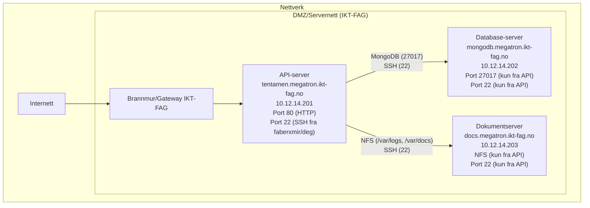

## Innholdsfortegnelse

1.  [Introduksjon](#introduksjon)
2.  [API Ruter](#api-ruter)
3.  [Serveroppsett](#serveroppsett)
    *   [IP-plan](#ip-plan)
    *   [Nettverksdiagram](#nettverksdiagram)
4.  [Database](#database)
    *   [ER-diagram](#er-diagram)
5.  [Middleware](#middleware)

## Introduksjon

Formålet med dette prosjektet er å utvikle og rulle ut en enkel REST API-tjeneste med tilhørende database. Tjenesten skal driftes på et sikkert oppsett med tre virtuelle maskiner.

## API Ruter

| Metode | Rute          | Beskrivelse                             |
| :----- | :------------ | :-------------------------------------- |
| GET    | `/status`     | Returnerer `{ status: "OK", ... }`      |
| GET    | `/items`      | Returnerer en liste med objekter i JSON |
| POST   | `/items`      | Tar imot JSON-data og legger til et objekt |
| DELETE | `/items/:id`  | Sletter et element fra databasen        |

## Serveroppsett

### IP-plan

| Rolle           | Domenenavn                  | IP-adresse        | Beskrivelse                               |
| :-------------- | :-------------------------- | :---------------- | :---------------------------------------- |
| API-server      | `tentamen.14.ikt-fag.no` | `10.12.[pool].201`  | Hoster API-et ditt                        |
| Database-server | `mongodb.14.ikt-fag.no`  | `10.12.[pool].202`  | Kjører MongoDB                            |
| Dokumentserver  | `docs.14.ikt-fag.no`     | `10.12.[pool].203`  | Lagrer dokumenter og logger (via NFS)     |

### Nettverksdiagram

**Flyt:**
1.  Klientforespørsler kommer inn til API-serveren på port 80.
2.  API-serveren kommuniserer med Database-serveren for dataoperasjoner.
3.  API-serveren skriver logger til Dokumentserveren via NFS.
4.  Dokumentasjon lagres på Dokumentserveren via NFS.

## Database

Tjenesten bruker MongoDB som database.

### ER-diagram (Entitetsrelasjonsdiagram)

Databasen har én hovedcollection: `items`.

## Middleware

### Logger

En middleware ([`middleware/logger.js`](./middleware/logger.js)) logger hver request til API-et.
Loggformat: `dd.mm.yyyy - /url`
Loggfil: `/var/logs/api.log` (på dokumentserveren, montert på API-serveren).
Hvis `/var/logs` ikke er tilgjengelig, faller den tilbake til en lokal `logs/api.log`-fil i prosjektmappen.